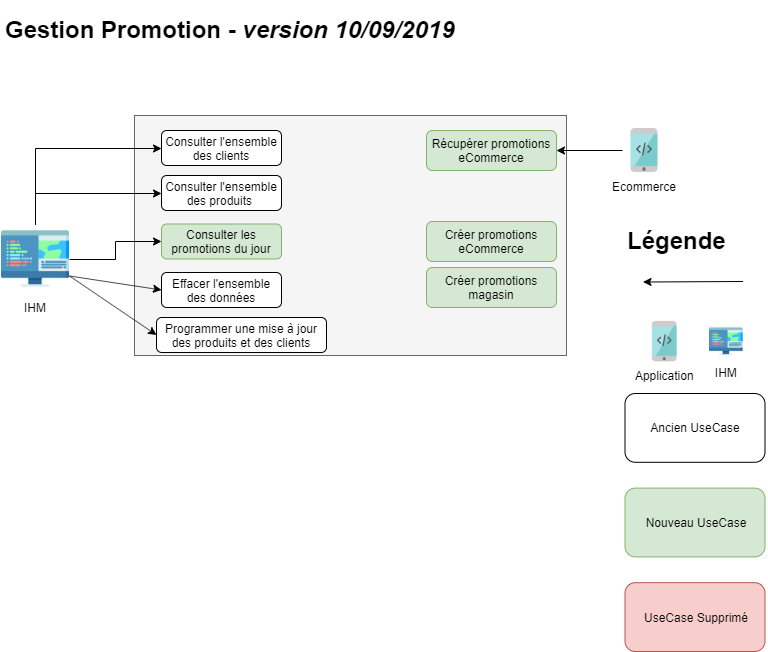

[Sommaire](https://ursi-2020.github.io/Documentation/)

# Sections

*[API](api.md)*
*[SCHEDULING](schedule.md)*

# Rôle de l'application

Le rôle de l'application de gestion des promotions est de créer des promotions ecommerce et magasins en fonction de différentes segmentations clients et des promotions globales au SI.

# Use Case

*[Anciennes versions des Uses Cases](use-case.md)*

# Membre du groupe

* Keyvan Meliani
* Dorine Lemière